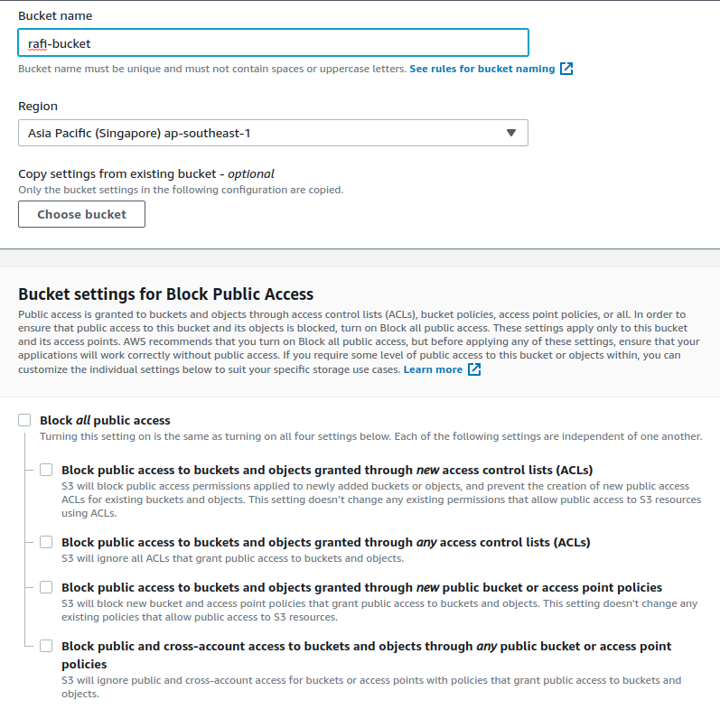
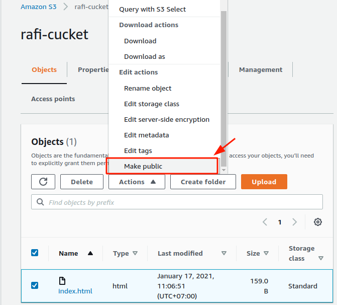

# S3-dan-Cloudfront
<!-- TABLE OF CONTENTS -->

  
Table of Contents

  <ol>
    <li><a href="#S3">S3</a></li>
    <li><a href="#Cloudfront">Cloudfront CDN</a>
    <ul>
        <li><a href="#Macam-macam CDN ">Macam-macam CDN</a></li>
        <li><a href="#Tahap-tahapnya: ">Tahap-tahap CDN</a></li>
    </ul>
    </li>
    
  </ol>

<!-- S3 -->
## S3
Sebelum melakukan setup pada cloudfront, pertama kita harus menyiapkan terlebih dahulu sebuah bucket di Amazon S3. Karena cloudfront sendiri menggunakan S3 bucket untuk penggunaannya.

Tahap-tahapnya:
1. Buat Bucket pada AWS S3

2. Upload file index.html dan ubah permisionnya menjadi public

<!-- Cloudfront -->
## Cloudfront
CDN (Content Delivery Network) adalah kumpulan dari server global yang terletak di beberapa data center dan tersebar di berbagai negara. Jaringan ini berfungsi untuk mengirimkan konten dari server ke suatu website. CDN meningkatkan kecepatan pengiriman data melalui jaringan server kepada visitor dari lokasi terdekat yang paling memungkinkan.

Katakanlah lokasi visitor berada di indonesia, sedangkan server dari website kita berada di US. Karena jarak antara lokasi visitor dan server, pengiriman konten memerlukan proses waktu yang lama. Tapi, dengan adanya server CDN yang berada di beberapa tempat seperti indonesia, india, US, proses pengiriman konten dapat menjadi lebih cepat.

### Macam-macam CDN
Karena kecanggihan dari laynan CDN ini, banyak sekali platfrom yang menediakan fasilitas
CDN yang dapat kita gunakan. Mulai dari yang gratis sampai dengan yang berbayar, berikut
merupakan beberapa macam CDN yang tersedia sampai saat ini.
1. Cloudflare
2. Amazon CloudFront
3. Incapsula
4. MaxCDN
5. RackSpace
6. Dll
Di AWS sendiri kita memiliki layanan yang memiliki fungsi sebagai Content Delivery
Network, yaitu adalah Cloudfront.
### Tahap-tahapnya:
3. Buat Bucket pada AWS S3

